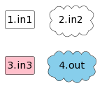
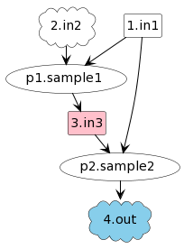
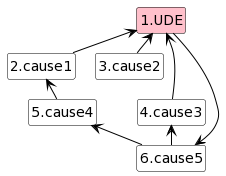
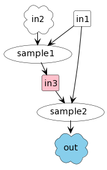
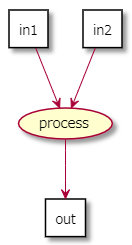
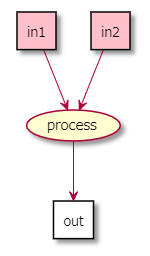
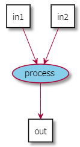
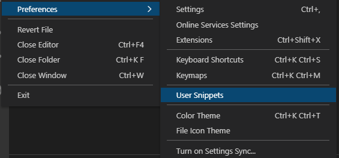
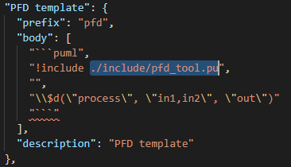

# ProcessFlowDiagram tool
[English](./README_EN.md)

PlantUML + VSCode(またはObsidian)でプロセスフロー図(PFD)を描くための
- PlantUMLプロシージャ
- VSCodeユーザスニペット
- Obsidianテンプレート

のセットです。

<!-- TOC -->

- [ProcessFlowDiagram tool](#processflowdiagram-tool)
    - [環境](#%E7%92%B0%E5%A2%83)
    - [PlantUMLプロシージャ](#plantuml%E3%83%97%E3%83%AD%E3%82%B7%E3%83%BC%E3%82%B8%E3%83%A3)
        - [entities](#entities)
        - [p](#p)
        - [connect_result_from_causes](#connect_result_from_causes)
        - [プロシージャの設定](#%E3%83%97%E3%83%AD%E3%82%B7%E3%83%BC%E3%82%B8%E3%83%A3%E3%81%AE%E8%A8%AD%E5%AE%9A)
            - [項目番号の表示/非表示](#%E9%A0%85%E7%9B%AE%E7%95%AA%E5%8F%B7%E3%81%AE%E8%A1%A8%E7%A4%BA%E9%9D%9E%E8%A1%A8%E7%A4%BA)
    - [VSCodeユーザスニペット/Obsidianテンプレート](#vscode%E3%83%A6%E3%83%BC%E3%82%B6%E3%82%B9%E3%83%8B%E3%83%9A%E3%83%83%E3%83%88obsidian%E3%83%86%E3%83%B3%E3%83%97%E3%83%AC%E3%83%BC%E3%83%88)
    - [使用イメージ](#%E4%BD%BF%E7%94%A8%E3%82%A4%E3%83%A1%E3%83%BC%E3%82%B8)
        - [注意点](#%E6%B3%A8%E6%84%8F%E7%82%B9)

<!-- /TOC -->

## 環境
以下の環境での動作を想定しています(後述のプロシージャ自体はPlantUMLが利用できる環境であれば使用可能です)。

|                 | VSCode                                                                                     | Obsidian                                                 |
|-----------------|--------------------------------------------------------------------------------------------|----------------------------------------------------------|
| プラグイン           | [Markdown preview enhanced](https://github.com/shd101wyy/vscode-markdown-preview-enhanced) | [PlantUML](https://github.com/joethei/obsidian-plantuml) |
| plantuml.jar(*) | >=2022.09                                                                                  | ←                                                        |
(*) プラグインに同梱されているplantuml.jarが古い場合、プロシージャが利用している関数が実装されていないためエラーとなります。

## PlantUMLプロシージャ
PFDを描くにあたって必要となる`プロセス`と`入出力(中間成果物)`との接続の記述を簡略化するためのものです。  
`pfd_tool.pu`がプロシージャの定義ファイルにあたり、使用するには以下のように`include`を行う必要があります。
```
!include PATH_TO_DIR/pfd_tool.pu
```

定義ファイルには以下のプロシージャが定義されています。

### entities
```
$entities("入出力1,入出力2,...")
```
PFDを構成する入出力((中間)成果物)を、","区切りで定義します。  
定義した順にエイリアスとして`連番`が付与されます。

各成果物について、以下の装飾をすることができます。
- 先頭に`c:`を付与
  - 表示を雲形(cloud)とします。
- 末尾に`#COLOR`を付与
  - 表示色を`COLOR`にします。

[サンプル](https://www.plantuml.com/plantuml/uml/JSwnJiGm3CRnFKzHxXX0EZLSML2d3eYPDq1kObehYHt5ZYhUdWuCZD_lM_wB6ZJh9Ri7uf1xn64tgpfxt-0ODxAzhrsn1M53jZ58yP3Qszr_DWce-f7bU2VO6XHVWDZNx_Xb8dcitMaYhd1U0qj4nJfCB_-m0QS_TEuHsSW8zUb2VB-5cNYw4RzUAt4wftIxQlfPSyVBirkGuvdz2m00)
```
$entities("in1,c:in2,in3#pink,c:out#skyblue")
```


### p
```
$p("入力1 入力2 > 出力", "プロセス名")
```
プロセスを定義し、定義済みの入出力とプロセスを接続します。  
`>`の左側が入力、右側が出力として扱われます。  
こちらも定義した順にエイリアスとして`p連番`が付与されます。

プロセスについても、`$entities`と同様に表示色を設定することができます。

[サンプル](https://www.plantuml.com/plantuml/uml/JS-nJiCm4CRnFKzXt0v5YcAICA0Eg0DYvWtGrJdQa-spvJkhuktnWA3Zz_zDtqaKghOKXmTY7zk6vgfQvEXSXTjq8RssSnEiFhCYw-HpSX3go-m-QlOeyXxpxOtWKY6v1CIkV6sVcdESIXia41VeP3XlA5ZCydGNAt3uZSCUMKa9vM29vz4VYPUHUDqLuj1dRhgJy7sE3UtZi2y7Evl5l9hLZiOAf19n_eErm_C_B1s64_BMZ_u0)
```
$entities("in1,c:in2,in3#pink,c:out#skyblue")
$p("1 2 > 3", "sample1")
$p("1 3 > 4", "sample2")
```


### connect_result_from_causes
```
$connect_result_from_causes("原因1 原因2 > 結果1, 原因3 原因4 > 結果2")
```
PFDではなく、CRT(現状ツリー)風のツリーを描くために使用します。  
`$entity`で定義された要素を原因/結果として、それぞれを接続します。

[サンプル](https://www.plantuml.com/plantuml/uml/JSpFIWCn4CVnUvvYh1uKPEDk_o0YqaFrxCLROOdPQHiscOJCX7rzi-f2J_doI_BPivWi9NXruyZwCY1SH1A_Q9tDr9oTNCftOSmsaY19OsFGPipFhVxCqIBpXu_JmPbpDa47uqYdqz1BZBv9HV7eA9bw1HG7P4pGFLsDsT3uFwgxgZjnoFUhe_ewlDycH-FZKLbJ6DibkYNMIsoMsDPOFLJ8HYAqqcVaugK_vHZw-SKVtS8hTB26-TyMtc0MT_NSm0oqjNQ_pXvfAC7_0000)
```
$entities("\
UDE#pink,\
cause1,\
cause2,\
cause3,\
cause4,\
cause5,\
")

$connect_result_from_causes("\
1 < 2 3 4,\
5 > 2,\
6 > 4 5,\
1 > 6\
")
```


### プロシージャの設定
#### 項目番号の表示/非表示
`!$numbered = 0`と設定すると、定義された入出力とプロセスに付与された連番を非表示にすることができます。  
(各プロシージャの呼び出し前に設定する必要があります。)

[サンプル](https://www.plantuml.com/plantuml/uml/JSd1JWCX483XEqz1QGyrsIpTNG-cYQO7uzatC2oCxGGO23EayUtTWr6F__zTM5oJdfFQ8VdK0-YRIEMpjStTnolAhQ-TeVb20YIZBzcws9uc-zwA1-QtLEwlwAxDPPiTagsVuKDAIMFjYYDITHjfAW4OgfvF_sPp57-csXsevnKQ1FsiJ-e092W8V3H8q-3FIFE0jEmhKjooTDbp_5fJ1_EW3lLe9Zth5xsOGHjskIQOVc7PuF4FvWtK1IZqdBu1)
```
!$numbered = 0
$entities("in1,c:in2,in3#pink,c:out#skyblue")
$p("1 2 > 3", "sample1")
$p("1 3 > 4", "sample2")
```


<details>
<summary>以前の書き方の説明</summary>


PFDを描くにあたって必要となる、`入力`と`プロセス`、`プロセス`と`出力`の接続を簡略化するためのプロシージャが定義されています。  
`入力`, `出力`は、`,`または` `(半角スペース)区切りで複数指定することができます。

| プロシージャ                       | 使用例                          | 説明                                                                                                                                                                                                                                                                                                                                | 結果                                         |
|------------------------------|---------------------------------|-----------------------------------------------------------------------------------------------------------------------------------------------------------------------------------------------------------------------------------------------------------------------------------------------------------------------------------|----------------------------------------------|
| $p(outputs, inputs, process) | $p("out", "in1,in2", "process") | 事前に定義済みの要素を使ってプロセスを描画します。<br>```in1 --> process```<br>```in2 --> process```<br>```process --> out```<br>と同じです。事前に定義がない場合は、表示が異なる場合があります。                                                                                                                                                                      |  |
| $d(outputs, inputs, process) | $d("out", "in1 in2", "process") | プロシージャ内で要素を定義しながらプロセスを描画します。<br>```agent "in1" as in1```<br>```agent "in2" as in2```<br>```usecase "process" as process```<br>```in1 --> process```<br>```in2 --> process```<br>```process --> out```<br>と同じです。<br>`inputs, outputs`の要素を`c:`で始めた場合、その要素は雲形(`cloud`として定義)になります。<br>また、事前に定義がある場合は、エラーとなります。 |  |
| $c(color, inouts)            | $c("#pink", "in1 in2")          | それまでに定義された入出力に指定された色を付与します。<br>```agent "in1" as in1 #pink```<br>```agent "in2" as in2 #pink```<br>と同じです。<br>`$c`は`$d`による要素定義の後に使用するようにしてください。                                                                                                                                                                    |  |
| $cp(color, process)          | $c("#skyblue", "process")       | それまでに定義されたプロセスに指定された色を付与します。<br>```usecase "process" as process #skyblue```と同じです。<br>`$cp`は`$d`による要素定義の後に使用するようにしてください。                                                                                                                                                                                              |  |

### 設定項目
デフォルトでは、入出力の区切り文字は`,`と` `に設定されています。  
英語環境をご利用の場合など` `区切りが不便な場合は、`pfd_tool.pu`の
```
!$space_delimiter = 1
```
を0に変更することで、`,`のみを区切り文字とすることができます。

</details>

## VSCodeユーザスニペット/Obsidianテンプレート
`vscode`フォルダ内のファイルがスニペット、`obsidian`フォルダ内のファイルがテンプレートにあたります。  
必要に応じて呼び出せるよう設定を行ってください。  
その際、呼び出し側のmarkdownファイルから`pfd_tool.pu`が参照できるよう、パスを編集してください(スニペット/テンプレートからの挿入後に編集することも可)。

以下のスニペット/テンプレートが含まれています。

| 項目      | 呼び出し(VSCode) | 動作                           | 用途                                                                     |
|-----------|----------------|------------------------------|------------------------------------------------------------------------|
| PFDテンプレート | pfd            | コードブロックとPFDの記述サンプルを合わせて挿入 | 描き始める際に1回呼び出すことを想定しています                                          |
| プロセス追加  | p              | pプロシージャを挿入                   | 描きながら必要に応じて呼び出すことを想定しています                                        |
| CRTテンプレート | crt            | コードブロックとCRTの記述サンプルを合わせて挿入 | 描き始める際に1回呼び出すことを想定しています                                          |
| ノート追加   | n              | ノートブロックを挿入                   | 描きながら必要に応じて呼び出すことを想定しています<br>末尾の接続先として任意のエイリアスを指定してください |

<details>
<summary>以前のスニペットの説明</summary>

## VSCodeユーザスニペット
`markdown.json`がスニペットにあたります。  
ファイル->設定->ユーザスニペットと開き、markdown.jsonに内容を追加してください。  
 

またその際、`PFD template`のパス(画像の選択部分)を適切な値に修正してください。  


プロシージャの入力をサポートするスニペットが定義されています。  
スニペットの呼び出しは、markdownドキュメントにおいて`使用例`の文字列入力後に`Ctrl+Space`で行います(VSCodeの設定によります)。

| スニペット                         | 使用例 | 説明                                                                                                         |
|-------------------------------|--------|------------------------------------------------------------------------------------------------------------|
| PFD template                  | pfd    | Markdown Preview EnhancedのPlantUMLコードブロックを、<br>`$d`プロシージャとともに出力します。<br>また、上述の区切り文字設定も合わせて出力します。 |
| draft process                 | d      | `$d`プロシージャを出力します。                                                                                          |
| draft process from clipboard  | c      | クリップボードの内容が`in`, `out`に入った`$d`プロシージャを出力します。                                                             |
| define color for deliverables | c      | `$c`プロシージャを出力します。                                                                                          |
| define color for process      | cp     | `$cp`プロシージャを出力します。                                                                                         |
| multi line note               | n      | 複数行ノートのテンプレートを出力します。<br>リンク先は適切に設定してください。                                                          |
| multi line note to clipboard  | nc     | 複数行ノートのテンプレートを出力します。<br>リンク先はクリップボードの要素になります。                                                        |

</details>

## 使用イメージ
1. PFDテンプレートを使って、PFDを描き始めます。
1. `$entities`に最終成果物から順に中間成果物を列挙します。
1. `$p`で最終成果物と入力となる中間成果物を接続します。
1. 2-3を必要なだけ繰り返します。

### 注意点
`$entity`に記述した入出力が不要であることが途中で分かった場合、単純に削除してしまうとエイリアスの連番が変わってしまい、プロセスとの接続関係が意図しないものになってしまいます。  
不要であることが分かってもそのまま残すか、半角スペース1つに置き換えることで対応するようにしてください。

<details>
<summary>以前の使用イメージ</summary>

## 使用イメージ
1. `pfd`スニペットを使って、PFDを描き始めます。
1. 最初に出力された`$d`の`out`を最終成果物に置き換えます。
1. `in`にプロセスに必要なものを`,`(または` `)区切りで列挙します。
1. `p`を最終成果物を生み出すプロセス名にします。
1. `r`, `c`スニペットを使ってプロセスで入出力をつなぎます。
1. プロセスの入出力に色をつける場合、`$c`を使って設定します。
1. 清書する場合、`$d`を`$p`に置き換え、要素の定義を追加します。

```puml
!include ./pfd_tool.pu
!$space_delimiter = 1

$d("満腹", "ラーメン お箸", "食べる")
$d("ラーメン", "カップ麺 卵 熱湯", "ラーメンをつくる")
$d("カップ麺", "c:今日の気分", "カップ麺を選ぶ")
$d("熱湯", "水,電気ポット", "お湯を沸かす")

```

## 制限事項

### 記号の取り扱い
PlantUMLの要素で文字列に記号(`！`や`？`など)が含まれると、要素接続時にエラーとなる場合があります。  
これを回避するため、`$d`プロシージャではエイリアス設定時に一部の記号を削除しています。
```
agent "今日なに食べる？" as 今日なに食べる
```
したがって、記号のみが異なる文字列同士は同じエイリアスに置換されるため、意図しない動きとなる場合があります。

例：  
以下の場合、inとoutが同じになってしまいます。
```
$d("今日なに食べる？", "今日なに食べる！", "なに食べるか決める")
```
```puml
!include ./pfd_tool.pu

$d("今日なに食べる？", "今日なに食べる！", "なに食べるか決める")
```
</details>