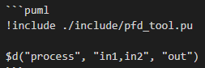
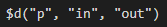
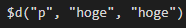
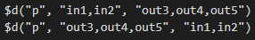

# ProcessFlowDiagram tool
PlantUML + VSCodeでプロセスフロー図(PFD)を描くための
- PlantUMLプロシージャ
- VSCodeユーザスニペット

のセットです。

ユーザスニペットは、[Markdown Preview Enhanced](https://shd101wyy.github.io/markdown-preview-enhanced/#/) extensionとセットで使うことを想定しています。

## PlantUMLプロシージャ
`pfd_tool.pu`がプロシージャにあたります。

PFDを描くにあたって必要となる、`入力`と`プロセス`、`プロセス`と`出力`の接続を簡略化するためのプロシージャが定義されています。

|プロシージャ|使用例|説明|結果|
|---|---|---|---|
|$p(process, inputs, outputs)|$p("process", "in1,in2", "out")|事前に定義済みの要素を使ってプロセスを描画します。<br>```in1 --> process```<br>```in2 --> process```<br>```process --> out```<br>と同じです。事前に定義がない場合は、表示が異なる場合があります。||
|$d(process, inputs, outputs)|$d("process", "in1,in2", "out")|プロシージャ内で要素を定義しながらプロセスを描画します。<br>```agent in1```<br>```agent in2```<br>```usecase process```<br>```in1 --> process```<br>```in2 --> process```<br>```process --> out```<br>と同じです。事前に定義がある場合は、エラーとなります。||


## VSCodeユーザスニペット
`markdown.json`がスニペットにあたります。  
ファイル->設定->ユーザスニペットと開き、markdown.jsonに内容を追加してください。  
 

またその際、`PFD template`のパス(画像の選択部分)を適切な値に修正してください。  


プロシージャの入力をサポートするスニペットが定義されています。  
スニペットの呼び出しは、markdownドキュメントにおいて`使用例`の文字列入力後に`Ctrl+Space`で行います。

|スニペット|使用例|説明|結果|
|---|---|---|---|
|PFD template|pfd|Markdown Preview EnhancedのPlantUMLコードブロックを、<br>`$d`プロシージャとともに出力します。||
|draft process|d|`$d`プロシージャを出力します。||
|draft process from clipboard|c|クリップボードの内容が`in`, `out`に入った`$d`プロシージャを出力します。||
|reverse draft process from current line|r|カーソルがある行の`$d`プロシージャについて、<br>`in`と`out`を入れ替えた`$d`プロシージャを出力します。||

