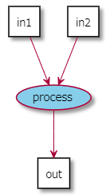
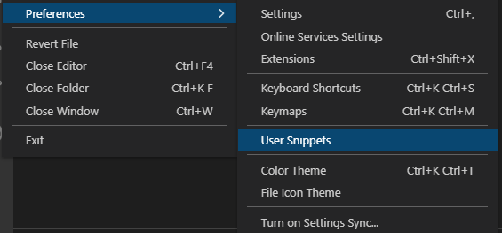

# ProcessFlowDiagram tool
These are the tool set for drawing Process Flow Diagram (PFD) using PlantUML + VSCode.  
The tool set contain below.
- Procedure of PlantUML
- Snippet for VSCode

The snippet for VSCode assume to use with [Markdown Preview Enhanced](https://shd101wyy.github.io/markdown-preview-enhanced/#/) extension.

## Procudure of PlantUML
`pfd_tool.pu` is the procedure file.  
It has some procedures to support to write `Inputs` to `Process`, and `Process` to `Outputs` that required to draw PFD.  
Multiple `Inputs` and `Outputs` can be written by "," delimiter.


|Procedure|Example|Explain|Result|
|---|---|---|---|
|$d(outputs, inputs, process)|$d("out", "in1,in2", "process")|Draw process while defining each elements.<br>This procedure will extract as below.<br>```agent "in1" as in1```<br>```agent "in2" as in2```<br>```usecase "process" as process```<br>```in1 --> process```<br>```in2 --> process```<br>```process --> out```<br>If `inputs` or `outputs` started by `c:`, that element displays as cloud.<br>Note that there is an error occur if you define the element as same name at out of procedure.||
|$c(color, inouts)|$c("#pink", "in1,in2")|Fill color to the defined `inputs` or `outputs`.<br>This procedure will extract as below.<br>```agent "in1" as in1 #pink```<br>```agent "in2" as in2 #pink```<br>Note that this procedure should be written after`$d`.||
|$cp(color, process)|$c("#skyblue", "process")|Fill color to the defined `process`.<br>This procedure will extract as below.<br>```usecase "process" as process #skyblue```<br>Note that this procedure should be written after`$d`.||

### Setting
As a default, the procedure sets the delimiter as `,` and ` `.  
For English user, please overwrite this setting to 0 to disable ` ` delimiter like below.
```
!$space_delimiter = 0
```

## Snippet for VSCode
`markdown.json`is the snippet for this tool set.  
For setting this snippet, open "File" -> "Preferences" -> "User Snippets" and add contents to "markdown.json".  
 

And please modify include path to appropriate value of your environment.   


There are various snippet exists to support the define or input to use procedure.  
To call the snippet, you should type "Shortcut" that described in below table then `Ctrl+Space` (it depends on your setting of VSCode).  

|Snippet|Shortcut|Explain|
|---|---|---|
|PFD template|pfd|Output PlantUML code block for Markdown Preview Enhanced extension with `$d` and other sample procedure.<br>It also output some other settings like delimiter.|
|draft process|d|Output `$d` procedure.|
|draft process from clipboard|c|Output `$d` procedure with `in`, `out` filled by clipboard value.|
|define color for deliverables|c|Output `$c` procedure.|
|define color for process|cp|Output `$cp` procedure.|
|multi line note|n|Output multi line note template.|
|multi line note to clipboard|nc|Output multi line note template linked to the clipboard element.|


## Example to use
1. Type `pfd` and call snippet to start drawing.
1. Modify `out` in `$d` to your final output.
1. Modify `in`s in `$d` with `,` delimiter.
1. Modify `process` to appropriate name.
1. Copy one `in` to clipboard, then type `c` to call "draft process from clipboard".
1. Repeat 2 to 5.
1. If you want to fill color to process, type `$c` or `$cp` to set.

```puml
!include ./pfd_tool.pu
!$space_delimiter = 0
left to right direction
skinparam nodesep 20
skinparam ranksep 20

$d("Satisfied", "Ramen,Chop sticks", "Eat")
$d("Ramen", "Cup Ramen,Egg,Hot water", "Cook a Ramen")
$d("Cup Ramen", "c:Mood of the day", "Choose a Ramen")
$d("Hot water", "Water,Kettle", "Boil water")

```

## Limitations
### Handling of symbols
There is an error using the symbols like `!` or `?` or something in PlantUML element.  
To avoid this, `$d` procedure replace remove some symbols.  
Therefore, there will be the same element if you specify the strings that differ only in symbols. 
